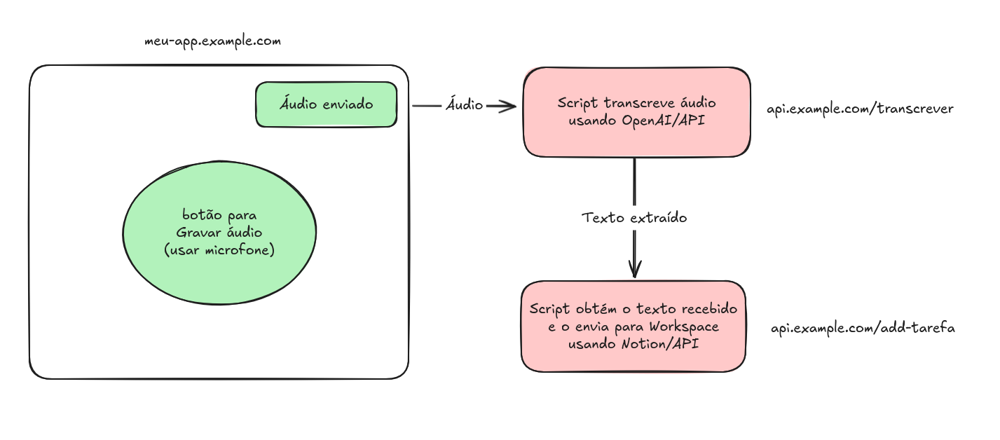

# DUME-AI
 #Fail

Fluxo de execução:
- Usuário manda audio pro GPT (que é convertido em texto) pedindo que ele execute uma tarfa e a mande pro Notion - Ex: Acessa a página X do meu Notion e coloque a tarefa varrer casa lá dentro de um to-do list.
- O GPT vai gerar um script Python (arquivo task-response) simples que vai acessar o script no servidor do Replit (arquivo replit-script).
- O script task-response vai executar e vai bater no o replit-script que vai acessar o Notion e vai preenchê-lo da forma correta.

_OBS: O projeto foi descontinuado por limitações do GPT e por problemas de BIOS. Kappa._
